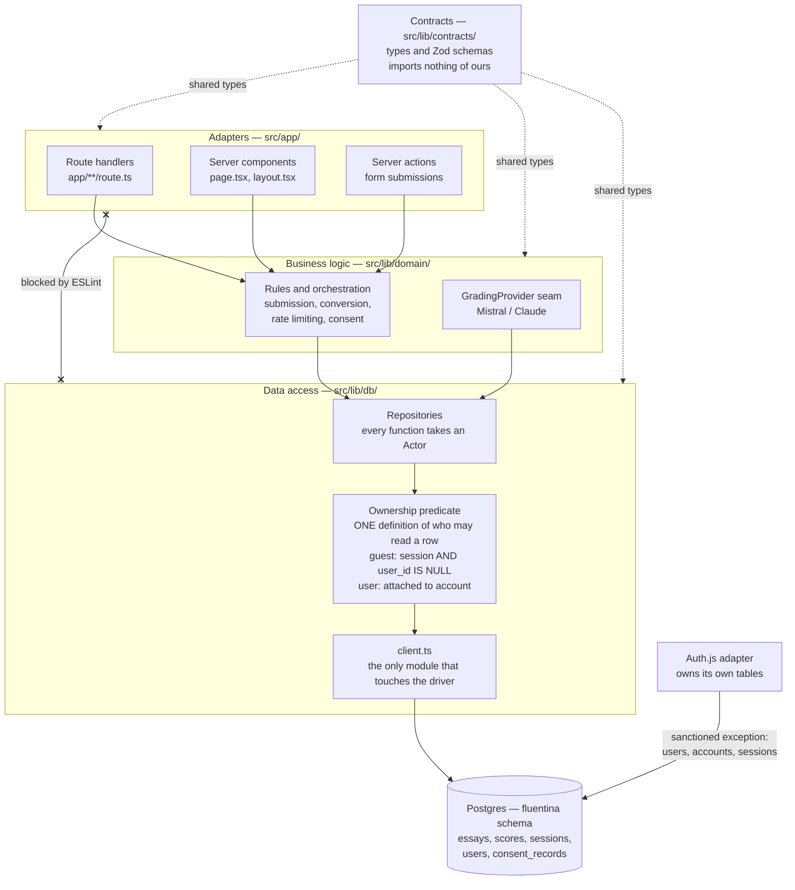

# Architecture Diagrams page — changes

Approved by Irina: add a new component diagram. The two container-diagram
corrections below are included because the current version is factually wrong
independently of the layering decision, and adding a correct new diagram beside
an incorrect old one would leave the page contradicting itself.

---

## A. New diagram — "Fluentina web app: internal layering"

Add as a second component diagram, beside the existing grading-pipeline one.
Layers are components, not containers, which is why this is a new diagram
rather than a fatter container diagram.

**Walkthrough.** All three server entry points — route handlers, server
components and server actions — reach data only through the business layer.
That matters because "check ownership in the API" would cover just the first of
the three, while every page in this app renders on the server too.

Every data-access function takes the current actor as a required first
argument, and one shared predicate decides who may read a row. The guest half
of that predicate carries the post-conversion cutover rule: a guest owns a row
only while it is unattached, so the session identifier stops authorising reads
the moment conversion attaches the record to an account. The 30-day retention
job selects on the same condition, so conversion and retention agree by
construction rather than by two developers reading the same paragraph.

The crossed link is the boundary that is machine-enforced: an ESLint rule fails
the build if anything in the adapter layer imports data access directly.

Auth.js is the one sanctioned path from outside the data layer to Postgres.
Those are the library's own tables, not ours.

---

## B. Container diagram — two corrections

### 1. The box label is wrong, and it teaches the wrong lesson

"API Routes" is not the only thing that reads Postgres. Server components do
too, and server actions will once forms land. A reader taking the diagram
literally concludes that rendering a page is a client-side call to an API
route, which is not how this app works — and that misunderstanding is exactly
what makes "enforce ownership at the API layer" sound sufficient when it is
not.

Relabel to **"Next.js app — route handlers, server components, server
actions"**, and annotate its arrow to Postgres:

> via business logic to data access (ADR-14); ownership enforced in data access

### 2. The auth library's path to Postgres is missing

Auth.js writes its own tables through its adapter, not through our data access.
That arrow does not appear at all. It is the single sanctioned exception in
ADR-14, so it should be visible rather than implied.

Add an arrow labelled **"Auth.js adapter — own tables (users, accounts,
sessions)"**.

---

## Rendering note

The diagrams page authors each diagram as Mermaid source in a code block,
because that page has no image upload. The block above follows the same
convention and renders in mermaid.live if the site has no Mermaid macro.

One caveat: `x--x` is Mermaid's cross-ended edge, used here for the blocked
import. If the installed renderer is older and does not support it, replace
that line with a plain dotted edge labelled "blocked by ESLint" — the meaning
survives.
